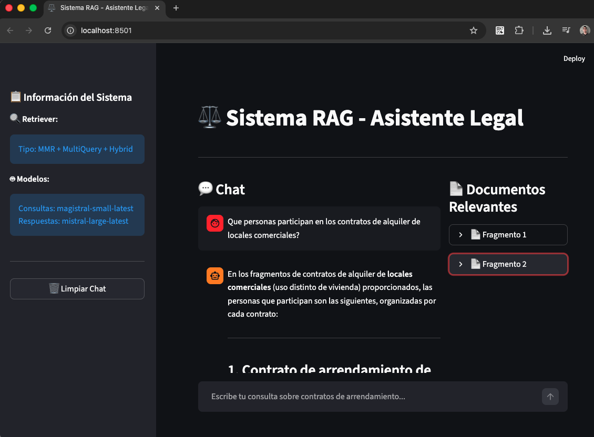
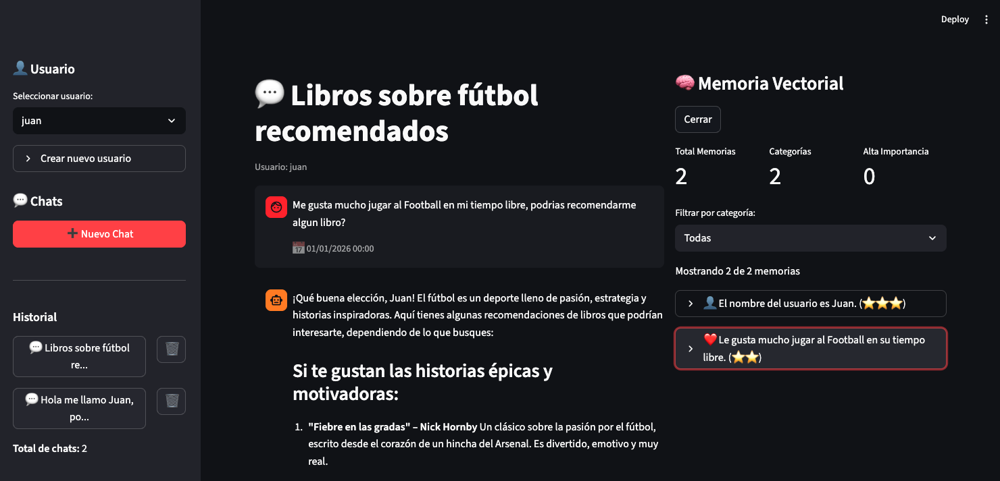

# LangChain & LangGraph

En esta carpeta hay un curso entero divido en Temas que cubren varios aspectos actualizados a la version `1.X` de LangChain y LangGraph. Junto con codigo de ejemplo de los temas tratados y mini proyectos que ponen en practica lo aprendido en cada capitulo.

## Contenido

A continuación encontrará los diferentes temas que se han cubierto en este nuevo curso:

1. **Tema 1:** Introducción a LangChain, primera aplicación con IA y LLMs
  - Configuracion de API Key
  - Plantillas de Prompts
  - Lenguaje de Expresión LCEL
  - Cadenas
  - Introduccion a Streamlit
2. **Tema 2:** Fundamentos de LangChain: Componentes Core
  - Runnables
  - Procesamiento Batch
  - Message Placeholder
  - Output Parsers
  - Validacion con Pydantic
3. **Tema 3:** RAG y LangChain, cargando y recuperando datos del mundo real
  - LangChain Community
  - Document Loaders
  - Text Splitters
  - Embeddings
  - Base de datos vectoriales
  - Retrievers
  - RAG (Retrieval Augmented Generation)

    

4. **Tema 4:** LangGraph
  - Componentes fundamentales
  - Estados y anotaciones
  - Control de flujo y Decisiones
5. **Tema 5:** Memoria y Gestión de Contexto con LangChain y LangGraph
  - Fundamentos de Memoria
  - Historial de Mensajes
  - Memory Saver
  - Memoria con Ventana Deslizante
  - Tipos de Memorias
  - Memoria Persistente
  - Memoria Vectorial

    

6. **Tema 6:** Agentes de IA y herramientas externas con LangChain y LangGraph
  - Herramientas (tools)
  - Herramientas personalizadas
  - Herramientas predefeinidas
  - Artefactos
  - Agentes
  - Modelo de Supervisor
