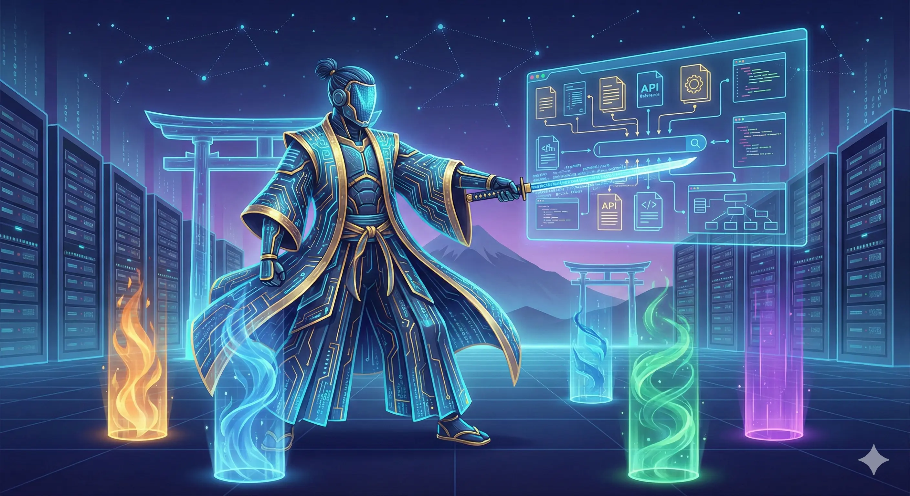
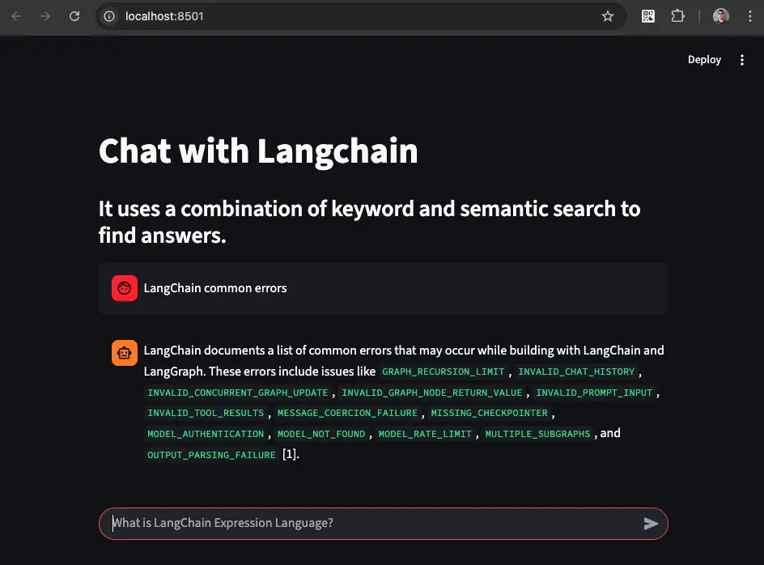

<div align="center">
  <a href="https://www.langchain.com/">
    <picture>
      <source media="(prefers-color-scheme: dark)" srcset="https://raw.githubusercontent.com/langchain-ai/.github/main/profile/logo-light.svg#gh-dark-mode-only">
      <source media="(prefers-color-scheme: light)" srcset="https://raw.githubusercontent.com/langchain-ai/.github/main/profile/logo-dark.svg#gh-light-mode-only">
      
    </picture>
  </a>
</div>

# Workshop

Este repositorio contiene materiales y ejemplos prácticos para aprender a utilizar LangChain, una biblioteca de Python para construir aplicaciones con modelos de lenguaje grandes (LLMs). El enfoque principal del workshop es enseñar cómo extraer, procesar y utilizar información de documentos para crear chatbots y otras aplicaciones interactivas.

## **Actualizaciones**

**[20-03-2026]** - LangChain ha cambiado mucho sus importaciones y ha hecho una reorganización de su API. Además se han agregado nuevos frameworks como LangGraph, LangSmith, etc. Por lo tanto se incluye nuevo contenido dentro de la carpeta [1.X](./1.X/README.md).

## Prerrequisitos para los Notebooks

- Python 3.11 (fue elaborado con esta versión)
- Jupyter Notebook (ipykernel ipython ipywidgets)

## PyTorch for macOS (intel) workaround

Si estas usando un sistema operativo macOS con arquitectura Intel, te encontrarás con una limitante de PyTorch para instalarse correctamente. Para solucionarlo, puedes usar una imagen de contenedor Docker que ya tenga todo lo necesario instalado. Aquí te dejo los pasos para hacerlo:

```sh
podman build -t langchain:local -f notebooks/macOS-intel.Dockerfile .
```

```sh
podman run -it --rm --name langchain -p 8888:8888 -v ./:/home/jupyter langchain:local
```

## Chatbot

El objetivo principal de este proyecto es facilitar el acceso a información documentada en varios repositorios de GitHub a través de un chatbot interactivo. Los usuarios pueden hacer preguntas al chatbot, el cual buscará la respuesta en la documentación extraída.

<p align="center">
  
</p>

Actualmente hay dos versiones del chatbot:

1. **Chatbot basado en OpenAI**: Utiliza modelos de lenguaje de OpenAI para responder preguntas basándose en la documentación extraída de GitHub.
2. **Chatbot basado en Mistral AI**: Utiliza modelos de lenguaje de Mistral AI para responder preguntas basándose en la documentación extraída de GitHub.

### **Configuración**

El funcionamiento del proyecto se puede manipular mediante el archivo **`config.yaml`**. Para utilizar el proyecto desde cero, sigue estos pasos:

1. **Extracción de textos**: Ejecute **`chatbot/<provider>/1.text_extractor.py`**. Este script exportará a la carpeta **`data`** un archivo jsonl con todos los archivos markdown de las documentaciones indicadas en la variable **`github`** en el archivo **`config.yaml`**. Estos archivos serán limpiados por **`1.text_extractor.py`** y estarán listos para ser divididos en Documentos de Langchain.
2. **Recreación de la base de datos de Chroma**: Ajuste la variable **`recreate_chroma_db`** en **`config.yaml`** a **`true`**. Esto indica que se creará una nueva base de datos de vectores Chroma y se almacenará localmente con el nombre "chroma_docs".
3. **Incrustación y almacenamiento de documentos**: Ejecute **`chatbot/<provider>/2.conversation_ai.py`**. Este script cargará el archivo jsonl creado en el paso 1 (asegúrese de agregar su nombre al archivo **`config.yaml`** en la variable **`jsonl_database_path`**). Luego, recreará la base de datos de Chroma incrustando todos los archivos json en el archivo jsonl creado, dividiéndolos y almacenándolos en la base de datos de vectores de Chroma para crear un índice.
4. **Uso de la base de datos existente**: Una vez que la base de datos de Chroma ha sido recreada, no es necesario volver a hacerlo. En la configuración, la variable **`recreate_chroma_db`** puede ajustarse a **`false`**, de modo que se utilizará la base de datos de Chroma existente en lugar de crear una nueva que implique volver a incrustar todos los archivos.
5. **Modo de chat**: Ajuste la variable **`chat_type`** en **`config.yaml`** a **`qa`** para una interacción en modo de preguntas y respuestas, o a **`memory_chat`** para un chat con memoria. En el modo de preguntas y respuestas, el chatbot genera respuestas basándose puramente en la consulta actual sin considerar el historial de la conversación. En el modo de chat con memoria, el chatbot puede recordar partes de la conversación para generar respuestas más contextualizadas.
6. **Interacción con los documentos**: Al ejecutar **`chatbot/<provider>/2.conversation_ai.py`**, podrás chatear con todos los documentos obtenidos de Github.

### **Instalación de dependencias**

Puedes instalar las dependencias usando Pip con el siguiente comando:

```sh
pip install -r chatbot/<provider>/requirements.txt
```

Luego, puedes ejecutar el proyecto con:

```sh
python chatbot/<provider>/2.conversation_ai.py
```

## RAG Chatbot



Para usar el chatbot RAG (Recuperación-Augmentada por Generación) con Mistral AI, sigue estos pasos:

1. Hace una ingesta de los documentos que vamos a utilizar:

```sh
cd notebooks/src
```

```sh
python ingest.py
```

2. Ejecuta el chatbot RAG:

```sh
streamlit run app.py
```

## **Contribuciones**

Este proyecto es de código abierto y aprecio cualquier contribución. Estoy particularmente interesado en las siguientes mejoras:

- La capacidad de ejecutar el proyecto con otros Modelos de Lenguaje de Máquina (LLMs).
- Conectividad con otras bases de datos vectoriales como Faiss o Weaviate.
- Adición de una interfaz de usuario y alojamiento en Hugging Face Hub Spaces.
- La capacidad de trabajar con todo el código abierto, incluyendo LLMs de Hugging Face Hub.

No hay pautas específicas para contribuir, sólo te pido que me ayudes a hacer de este proyecto algo más útil y eficiente. ¡Gracias por tu apoyo!
