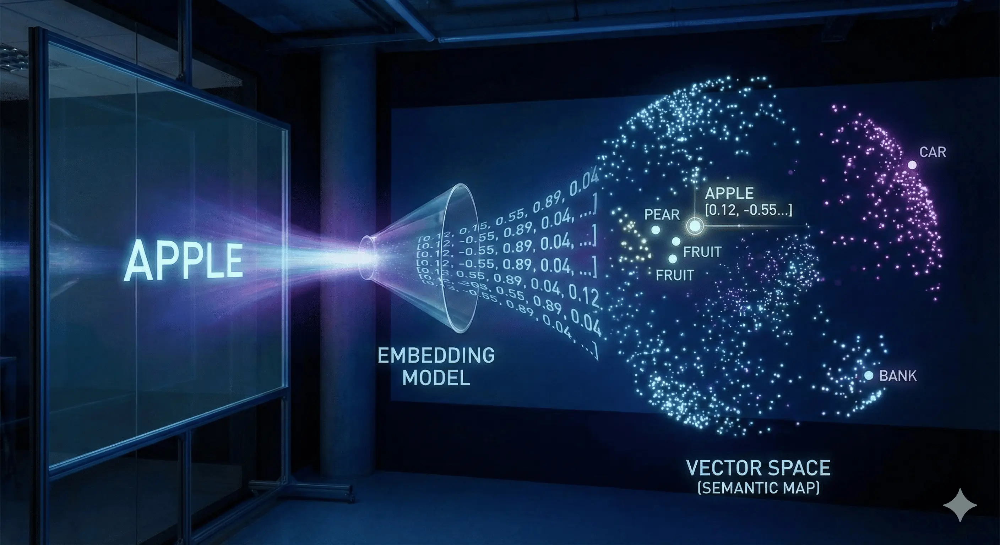

# EMBEDDINGS

**EL CONCEPTO:** Un `Embedding` es un proceso de traducción. Convierte Texto en un Vector (una lista de números como [0.1, -0.5, 0.8]). Estos números representan el significado semántico del texto, no solo las palabras clave.

**LA ANALOGÍA:** Imagina el vector como Coordenadas GPS. Las palabras con significados similares (ej. "Perro" y "Cachorro") se ubican en coordenadas cercanas. Las palabras con significados diferentes (ej. "Perro" y "Auto") se ubican en coordenadas lejanas.

**LOS PROVEEDORES:** OpenAI, Hugging Face y Cohere son como diferentes creadores de mapas. Cada uno utiliza una lógica única y un número diferente de dimensiones (ej. 1536 de OpenAI vs 768 de Hugging Face) para trazar su mapa.

**LA REGLA DE ORO:** Nunca mezcles proveedores. No puedes encontrar una ubicación en un mapa de OpenAI usando coordenadas de Hugging Face. Si generas embeddings de tus datos con OpenAI, debes realizar las consultas con OpenAI.