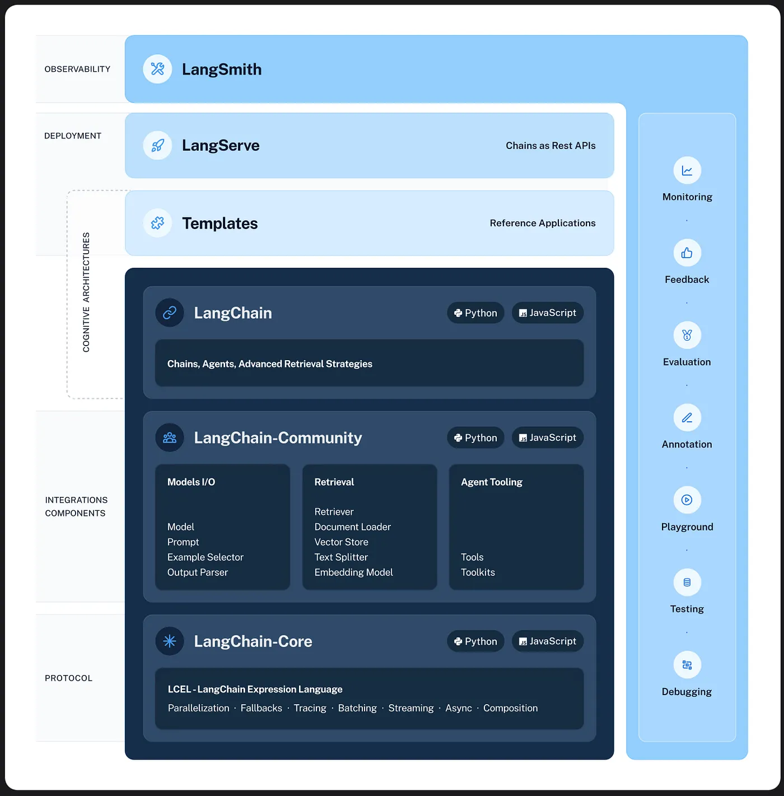

# LangSmith

LangSmith es una plataforma diseñada para ayudar a los desarrolladores a crear, probar y optimizar modelos de lenguaje. Proporciona herramientas y servicios que facilitan la gestión del ciclo de vida de los modelos de lenguaje, desde la experimentación hasta la implementación.

